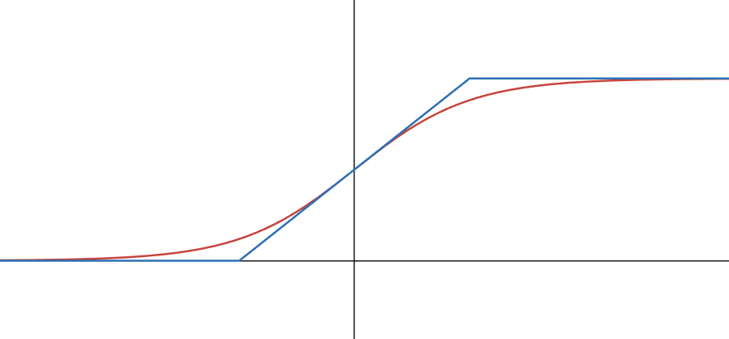

<!---

This file is used to generate your project datasheet. Please fill in the information below and delete any unused
sections.

You can also include images in this folder and reference them in the markdown. Each image must be less than
512 kb in size, and the combined size of all images must be less than 1 MB.
-->

## How it works

The device takes an input of format signed Q4.4 binary, computes a hardened sigmoid and provides 8-bit output. It can be a useful tool to offload AI training/inference. (However, do note, it is highly unlikely to observe a performance gain because of communication bottleneck and frequency of the chip.)

Domain: -8 to +7.9375, with resolution of 1/16

Range: 0 to 255 (mapping to 0.0 to 1.0 with resolution 1/256)

Sigmoid function:

$$\sigma(x) = \frac{1}{1+e^{-x}}$$

Hardened piecewise sigmoid function:

$$\sigma_h(x) = \begin{cases}
0 & \text{if } x \leq -2,\\
0.25x+0.5  & \text{if } x \in [-2, 2],\\
1  & \text{if } x \geq 2.
\end{cases}$$

The following diagram graphs both the ordinary (red) and hardened (blue) sigmoid function.

## How to test

Provide a 8-bit input in Q4.4 signed format and measure the output as an 8-bit binary output scaled from 0 to 255. 

To offload AI training/inference using tensorflow or pytorch, connect using `serial` and the decorator `@tf.custom_gradient`/inheriting `tf.keras.layers.Layer` or by inheriting `torch.autograd.Function` as illustrated in `example/tf` and `example/torch` respectively.

## External hardware

No external hardware is required.
